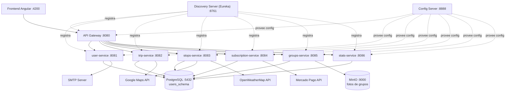
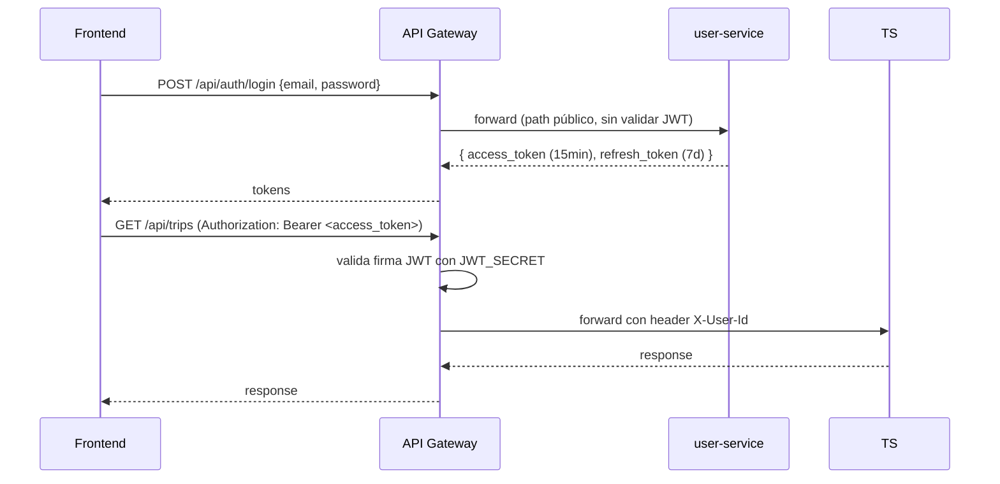

# Arquitectura de Microservicios — RouteIt

## Diagrama general



## Rutas del API Gateway

| Path | Servicio destino | Puerto |
|------|-----------------|--------|
| `/api/auth/**`, `/api/users/**` | user-service | 8081 |
| `/api/trips/**` | trip-service | 8082 |
| `/api/stops/**` | stops-service | 8083 |
| `/api/subscriptions/**` | subscription-service | 8084 |
| `/api/groups/**` | groups-service | 8085 |
| `/api/stats/**` | stats-service | 8086 |

### Paths públicos (sin validación JWT)

- `POST /api/auth/register`
- `POST /api/auth/login`
- `GET /api/auth/activate`
- `POST /api/auth/refresh-token`

## Flujo de autenticación JWT



## Tecnologías por servicio

| Servicio | Responsabilidad | Deps clave | Schema |
|---------|----------------|-----------|--------|
| discovery-server | Registro Eureka | Spring Cloud Netflix Eureka Server | — |
| config-server | Configuración centralizada | Spring Cloud Config Server | — |
| api-gateway | Routing + validación JWT | Spring Cloud Gateway, JJWT 0.12.6 | — |
| user-service | Auth, perfiles, email | Spring Security, JJWT, JavaMail | users_schema |
| trip-service | Viajes, rutas, gastos | OpenFeign, Google Maps SDK | trips_schema |
| stops-service | Paradas sugeridas, clima | Spring Cache, Google Maps, OpenWeatherMap | stops_schema |
| subscription-service | Pagos Premium | Mercado Pago SDK 2.1.24 | subscriptions_schema |
| groups-service | Grupos, fotos | MinIO SDK 8.5.12 | groups_schema |
| stats-service | Estadísticas KPIs | OpenFeign | stats_schema |

## Schemas PostgreSQL

Todos los servicios de negocio comparten una única instancia PostgreSQL con schemas separados:

```
routeit (database)
├── users_schema        → cuentas, sesiones, perfiles, vehículos
├── trips_schema        → viajes, waypoints, gastos, presupuesto
├── stops_schema        → paradas, POIs, clima cacheado
├── subscriptions_schema → suscripciones, pagos, webhooks
├── groups_schema        → grupos, membresías, fotos
└── stats_schema         → KPIs, métricas agregadas
```

## Orden de arranque (Docker Compose)

```
1. PostgreSQL + MinIO        (infraestructura, healthcheck en puertos)
2. Discovery Server (Eureka) (healthcheck GET /actuator/health)
3. Config Server             (depends_on: discovery-server healthy)
4. API Gateway               (depends_on: config-server healthy)
5. Servicios de negocio      (depends_on: postgres + config-server healthy)
   user-service, trip-service, stops-service,
   subscription-service, groups-service, stats-service
```
